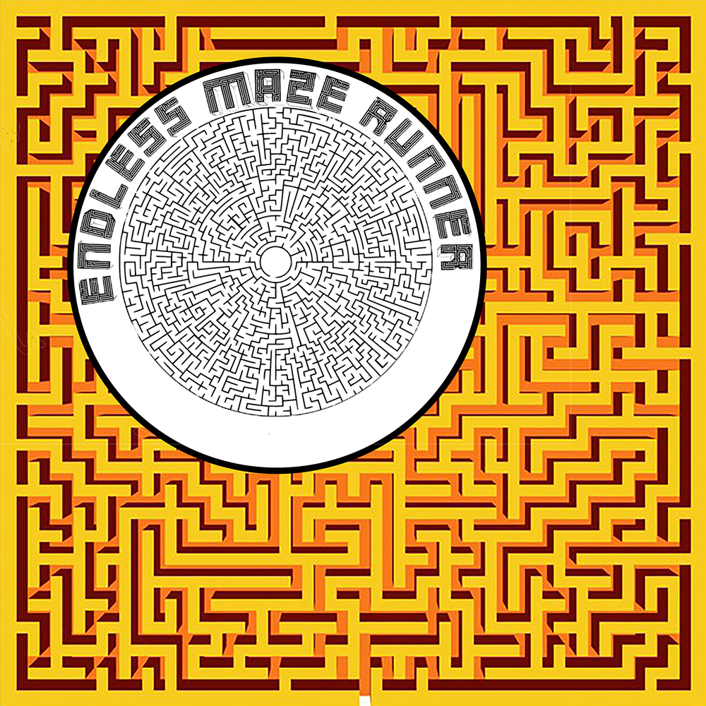
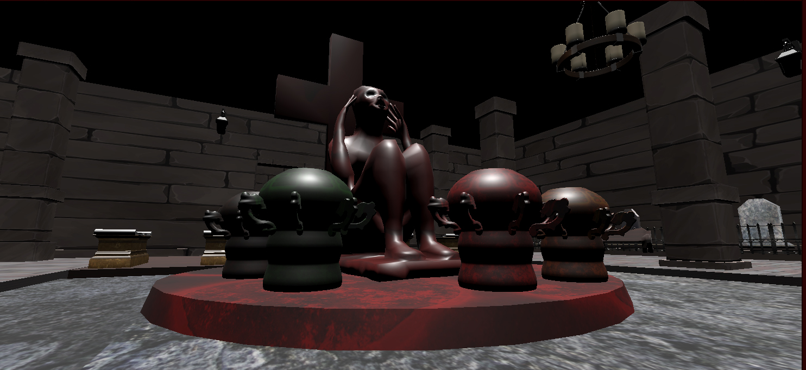
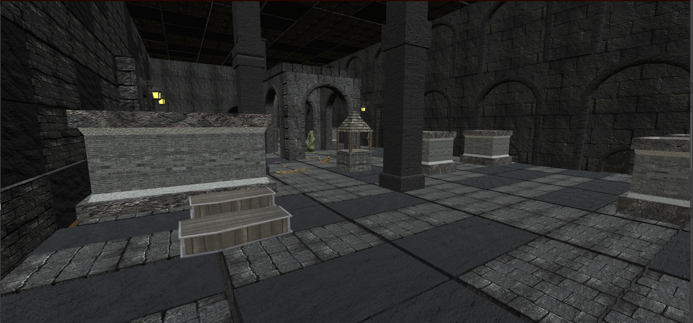

## Portfolio

---

### Published Games

[Pop Art Drink Smart Android version (Google Play)](https://play.google.com/store/apps/details?id=com.PISMOInkubator.PopArtDrinkSmart&hl=hr&gl=US)
 

 

  Pop Art Drink Smart is a very simple drinking game simulation that allows you to play in Free For All or in Teams mode. The goal of the game is to collect points by doing various tasks which cards give you. If you refuse to do the task you lose 10 points. The player loses additional points if he breaks the glass, vomits, or gives up the game. Before starting the game in a mode you set the score which has to be beaten in order to win the game. Currently, there are 110 different cards every with different artwork presenting pop art artworks downloaded from Freepik. com which I used very often doing freelance in graphic design looking for mockups and stock images. In the future, we are planning to add more cards and different decks. To be specific plan is to develop an Anime card deck and deck with cards drawn digitally from artists in our team. So for the start, we put into the game a couple of cards from those other decks which are in development. Cards are repeating so the game can continue until the score is beaten. The maximum score is 10 000 points so one game can last very long but the question is can you or your liver handle it.

You have also a version for Android to download.  Game is also available on Google Play - Just write "Pop Art Drink Smart" in toolbar. We are working on some minor changes in design and we will upload additional cards as often as we can

Thank you for using our software

This was a group project in game development education at PISMO INKUBATOR

We would like to thank our mentor Dominik Cvetkovski

We are:

Dejan Seretinek - Game Designer, Graphic Design, UI Designer

Saša Borojević - Man Menu Designer

Matej Jelić - Programmer

Domagoj Petrović - Programmer

---
[Pop Art Drink Smart Windows version (Page on Itch.io)](https://idejo.itch.io/pop-art-drink-smart)
 

---
[Endless Maze Runner (Page on Itch.io)](https://klaudija34.itch.io/endless-maze-runner)
 

 

 

---

  Endless Maze Runner is endless maze type of game with multiplayer option. Player is trapped in a maze with similar rooms. Only diffference between rooms is number of doors. Subway with opening doors lead to a different room. Map is crucial to orientate through game where you put a mark of room where you are currently so you can orientate. Goal of the game is to collect five torches with matching colors and bring them to altars with same colors.
  

### Word Press Page 

- [Restaurant Fillipi Word Press Page](https://www.restaurantfilippi.com/)
  
 

---

---

Page template forked from <a href="https://github.com/evanca/quick-portfolio">evanca</a>

<!-- Remove above link if you don't want to attibute -->
